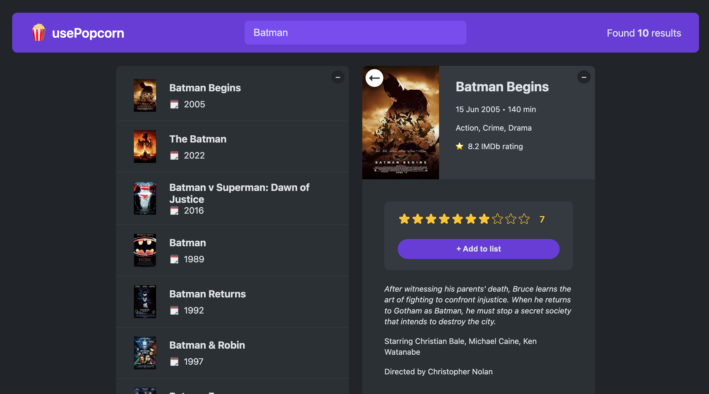

# <span style="color:#fde047;">usePopcorn </span>🍿

#### Movie app created while taking Jonas Schmedtmann's - Ultimate React Course

- Utilizing <a href="https://www.omdbapi.com/">OMDb API</a> for movies



## A User can:

- Search for favorite films powered by the OMDb API
- Find facts about favorite films like IMDb rating, actors, director and movie description
- Save favorite films to watched movie list
- Rate favorite films

## Topics of exploration:

1. How React works under the hood
2. Component life cycle
3. State management
4. useRef
5. Custom hooks

## Instructions To Start the App:

1. Fork usePopcorn repo
2. Git clone forked copy to local environment and open in IDE/code editor
3. Open a new terminal in IDE/code editor
4. Install dependencies

```
   npm install
```

5. Start React App

```
   npm start
```

🎬 <span style="color:#fde047">Enjoy usePopcorn!<span> 🍿
